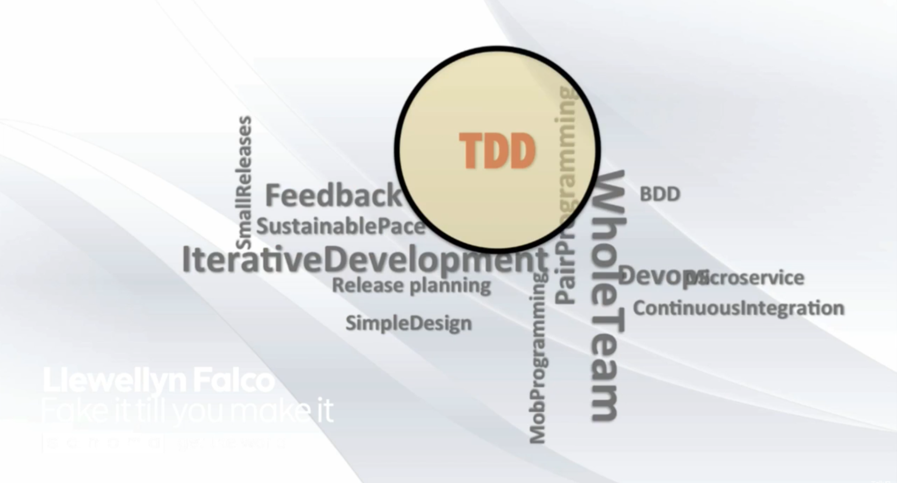

# «Fake It Till You Make It» FizzBuzz Kata

## What are we going to do?
In the whole world of Agile...

... there are a lot of different techniques.

But we will only focus on Test Driven Development.

And with in the world of Test Driven Development...

... we will only focus on the Refactoring part.

And within all these Refactoring techniques...

...we will only focus on «Fake It Till You Make It».

And within «Fake It Till You Make It»...

...we will only focus on Derivation.

## FizzBuzz
FizzBuzz from 1 - 20 will give you:

`1,2,Fizz,4,Buzz,Fizz,7,8,Fizz,Buzz,11,Fizz,13,14,FizzBuzz,16,17,Fizz,19,Buzz`

Why doesn't matter. The whole point of this technique is: We are going to make a working program out of this, without knowing why it works, but simply from getting a working example.

It is usually very easy to get a working example from your business partners. But it's remarkably hard to get complete requirements.

## Rules
### Separate
`"18585555555"` vs. `"1" + "8585555555"`

The second one is _less fake_ than the first one. Now I have a `1` I can do something with.

### Encapsulate
`"1" + "8585555555"` vs. `areaCode + "8585555555"`

`1` is _more fake_ than `areaCode`. This tells me «why?».

### Calculate
`"1"` vs. `"" + 1`

A solid hardcoded answer is _less information_ than a calculated answer from data.

### Automate
`numbers = [5,6,7,8,9,10]` vs. `numbers = [5..10]`

If you count form `5` to `10` don't just give me the numbers.

### Clean
🧹